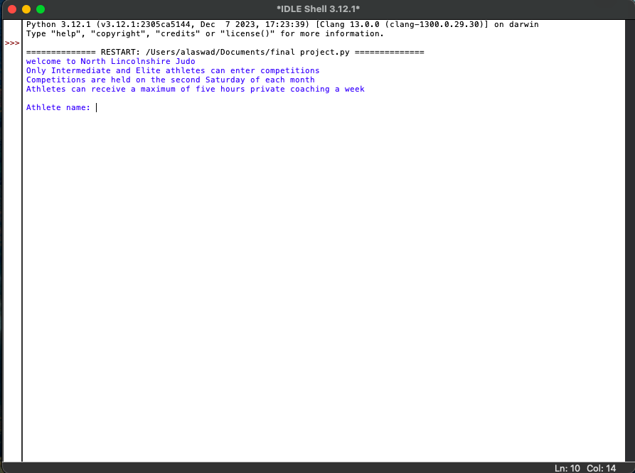
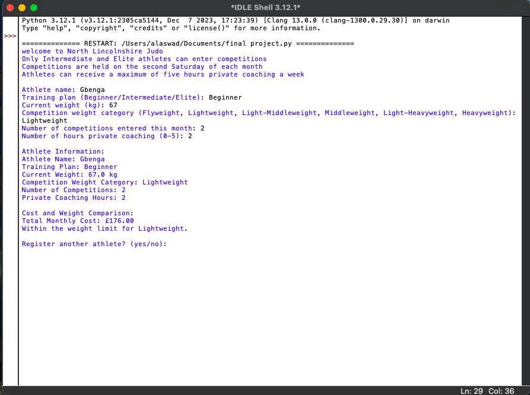
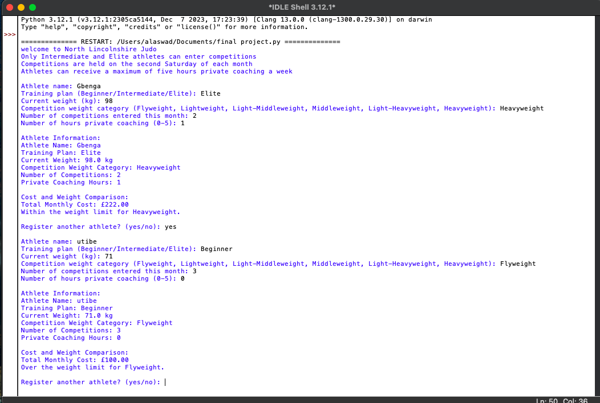
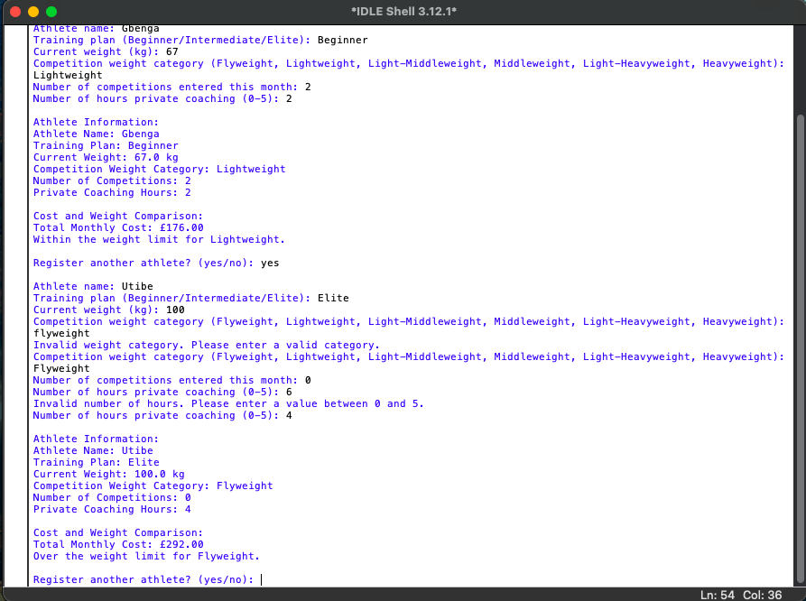

# 🥋 Judo Athlete Management System 


# Table of Contents

- [Project Overview](#project-overview)  
- [User Requirements](#user-requirements)  
- [System Features](#system-features)
- [Sample Output images](#sample-output-images) 
- [Future Enhancements](#future-enhancements)  
- [Project Challenges](#project-challenges)
- [Code Implementation](#code-implementation)  
   - [Constants & Configuration](#constants--configuration)  
   - [Input Validation](#input-validation)  
   - [Cost Calculation](#cost-calculation)  
   - [Weight Comparison](#weight-comparison)  
   - [Main Program Loop](#main-program-loop)   

---

### Project Overview  
*A Python/web solution for North Lincolnshire Judo to:*  
- Streamline athlete data management  
- Automate cost calculations  
- Provide weight category analysis  

---

### User Requirements  
**Inputs:**  
- Athlete name, training plan (Beginner/Intermediate/Elite)  
- Current weight (kg), competition category  
- Competitions entered, private coaching hours  

**Outputs:** 
- Itemized cost breakdown  
- Weight comparison report


---

### System Features  
| Feature | Description |  
|---------|-------------|  
| Multi-Athlete Support | Register unlimited athletes |  
| Cost Calculator | Training/competition fee breakdown |  
| Weight Analyzer | Visual category comparison |  
| Input Validation | Prevents invalid data entry |  


# Sample Output images






# Future Enhancements
 - Athlete performance tracking
 - Training session scheduler
 - Database integration

# Project Challenges
 - Challenge: Complex input validation
 - Solution: Implemented recursive validation with clear error messages

 - Challenge: Dynamic cost calculation
  - Solution: Created modular pricing functions

---

### Code Implementation

#### Constants & Configuration
```python
# Price structure and weight categories
TRAINING_PLAN_PRICES = {
    'Beginner': 25.00,
    'Intermediate': 30.00,
    'Elite': 35.00
}
PRIVATE_TUITION_PRICE_PER_HOUR = 9.50
COMPETITION_ENTRY_FEE = 22.00

WEIGHT_CATEGORIES = {
    'Heavyweight': float('inf'),  # No upper limit
    'Light-Heavyweight': 100,
    'Middleweight': 90,
    'Light-Middleweight': 81,
    'Lightweight': 73,
    'Flyweight': 66
}

---


### Input Validation

python

def get_athlete_info():
    while True:
        try:
            training_plan = input("Training plan (Beginner/Intermediate/Elite): ")
            if training_plan not in TRAINING_PLAN_PRICES:
                raise ValueError("Invalid training plan")
            
            current_weight = float(input("Current weight (kg): "))
            
            coaching_hours = int(input("Private coaching hours (0-5): "))
            if not 0 <= coaching_hours <= 5:
                raise ValueError("Hours must be 0-5")
                
            return training_plan, current_weight, coaching_hours
            
        except ValueError as e:
            print(f"Error: {e}. Please try again.")


### Cost Calculation

python

def calculate_total_cost(training_plan, competitions, coaching_hours):
    base_cost = TRAINING_PLAN_PRICES[training_plan] * 4  # Monthly
    
    if coaching_hours > 0:
        base_cost += coaching_hours * PRIVATE_TUITION_PRICE_PER_HOUR * 4
        
    if training_plan in ['Intermediate', 'Elite']:
        base_cost += competitions * COMPETITION_ENTRY_FEE
        
    return base_cost


### Weight Comparison

python

def compare_weight(weight, category):
    limit = WEIGHT_CATEGORIES[category]
    status = "Over" if weight > limit else "Within"
    return f"{status} {category} limit ({limit}kg)"


### Main Program Loop

python


def main():
    while True:
        try:
            # Get athlete data
            data = get_athlete_info()
            
            # Process and display results
            cost = calculate_total_cost(*data)
            weight_status = compare_weight(data[1], input("Competition category: "))
            
            print(f"\nMonthly Cost: £{cost:.2f}")
            print(f"Weight Status: {weight_status}")
            
            if input("\nAdd another? (y/n): ").lower() != 'y':
                break
                
        except Exception as e:
            print(f"Error: {e}")


---


